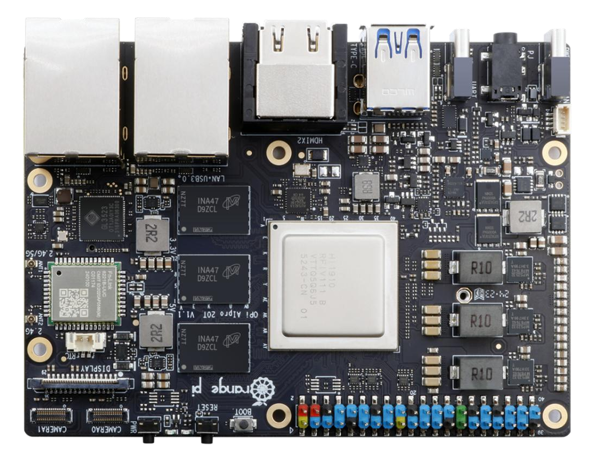

# 实验1：使用Dora操作机器人

## 1. 基于Rust的机器人开发框架-Dora
### 1.1 Dora 总体架构
### 1.2 Dora 数据流
### 1.3 Dora CLI
### 1.4 Dora 数据格式（Apache Arrow）
### 1.5 Dora 安装使用

## 2. 机器人基础
### 2.1 硬件组成及电机驱动控制
### 2.2 坐标系与位姿变换
### 2.3 轨迹规划
### 2.4 GEN72机械臂

## 3. 实验1-1 在OrangePi内实现Dora操作机械臂

### 3.1 环境配置

假定您已准备好OrangePi并为其烧录了ubuntu22.04系统。

> 训练营已为各位线下学员准备好环境，可跳过这步



启动OrangePi，并为其连接好屏幕键盘。连接显示器线时，需要注意，只能使用上面的HDMI接口：


更多信息可以参考这：[Orange Pi AI Pro 20T 用户手册](documents/OrangePi_AI_Pro_20T_昇腾_用户手册_v0.5.1.pdf)

然后使用密码登录。如果您使用的是训练营已配好的环境，密码是`gosim1234`

登录后，鼠标左键单击桌面左上角`Application`，打开菜单栏后再左键单击`Terminal Emulator`，启动终端。

检查dora是否安装，在终端中输入：

```bash
dara -V
```

如果正确安装，将看到输出：(版本号可能会不一样)

```
dora-cli 0.3.7
```

如若未正常安装，请参考`Dora-Embodied-AI-Camp/README.md`进行安装。

接下来的实验操作所需要的代码和文件已经准备好了，可以直接clone下来（已clone下来可以跳过这步）。在终端中输入：

```bash
git clone https://github.com/Ryu-Yang/Dora-Embodied-AI-Camp.git
```

克隆下来后，切换到本实验文件夹。在终端中输入：

```bash
cd Dora-Embodied-AI-Camp/lab1/OrangePi_only
```

### 3.2 配置yaml文件

在`Dora-Embodied-AI-Camp/lab1/OrangePi_only`文件夹中已写好一个`ctrl_arm.yml`文件，内容如下：

```yaml
nodes:
  - id: keyboard-listener
    path: keyboard.py
    inputs:
      tick: dora/timer/millis/10
    outputs:
      - char

  - id: key-interpolation
    path: key_interpolation.py
    inputs:
      keyboard: keyboard-listener/char
    outputs:
      - text

  - id: trans-cmd
    path: trans-cmd.py
    inputs:
      text: key-interpolation/text
    outputs:
      - movec
      - claw
      - save
      - clear
      - begin
      - stop
      - goto
  
  - id: arm
    path: gen72.py
    inputs:
      movec: trans-cmd/movec
      claw: trans-cmd/claw
      save: trans-cmd/save
      clear: trans-cmd/clear
      begin: trans-cmd/begin
      stop: trans-cmd/stop
      goto: trans-cmd/goto
    env:
      ROBOT_IP: 192.168.1.18  # GEN72 机械臂默认IP

```

### 3.3 键盘监听节点

在`Dora-Embodied-AI-Camp/lab1/OrangePi_only`文件夹中已写好`keyboard.py`文件作为键盘监听节点，内容如下：

```python
from pynput import keyboard
from pynput.keyboard import Events
import pyarrow as pa
from dora import Node
import time

node = Node()

with keyboard.Events() as events:
    while True:
        event = events.get(1.0)
        if event is not None and isinstance(event, Events.Press):
            if hasattr(event.key, "char"):
                if event.key.char == "p":
                    break
                if event.key.char == "z":
                    while True:
                        node.send_output("char", pa.array(["b"]))
                        time.sleep(5)
                if event.key.char is not None:
                    node.send_output("char", pa.array([event.key.char]))

```

### 3.4 按键识别节点

在`Dora-Embodied-AI-Camp/lab1/OrangePi_only`文件夹中已写好`key_interpolation.py`文件作为按键识别节点，内容如下：

```python
from dora import Node
import pyarrow as pa

node = Node()

for event in node:
    if event["type"] == "INPUT":
        if event["id"] == "keyboard":
            char = event["value"][0].as_py()
            print(f"""Keyboard recieved: {char}""")
            if   char == "w":
                node.send_output("text", pa.array(["forward"]))
            elif char == "s":
                node.send_output("text", pa.array(["backward"]))
            elif char == "d":
                node.send_output("text", pa.array(["right"]))
            elif char == "a":
                node.send_output("text", pa.array(["left"]))
            elif char == "q":
                node.send_output("text", pa.array(["arm take"]))
            elif char == "e":
                node.send_output("text", pa.array(["arm put"]))
            elif char == "t":
                node.send_output("text", pa.array(["arm Xp"]))
            elif char == "g":
                node.send_output("text", pa.array(["arm Xn"]))
            elif char == "f":
                node.send_output("text", pa.array(["arm Yn"]))
            elif char == "h":
                node.send_output("text", pa.array(["arm Yp"]))
            elif char == "r":
                node.send_output("text", pa.array(["arm Zp"]))
            elif char == "y":
                node.send_output("text", pa.array(["arm Zn"]))
            elif char == "x":
                node.send_output("text", pa.array(["save"]))
            elif char == "c":
                node.send_output("text", pa.array(["clear"]))
            elif char == "b":
                node.send_output("text", pa.array(["begin"]))
            elif char == "n":
                node.send_output("text", pa.array(["stop"]))
            elif char == "m":
                node.send_output("text", pa.array(["goto"]))

```
### 3.5 命令识别节点
在`Dora-Embodied-AI-Camp/lab1/OrangePi_only`文件夹中已写好`trans_cmd.py`文件作为命令识别节点，内容如下：

```python
from dora import Node
import pyarrow as pa
from enum import Enum

class Action(Enum):
    Xp      = ("arm Xp", "movec", [0.01, 0, 0, 0, 0, 0, 0.1])
    Xn      = ("arm Xn", "movec", [-0.01, 0, 0, 0, 0, 0, 0.1])
    Yp      = ("arm Yp", "movec", [0, 0.01, 0, 0, 0, 0, 0.1])
    Yn      = ("arm Yn", "movec", [0, -0.01, 0, 0, 0, 0, 0.1])
    Zp      = ("arm Zp", "movec", [0, 0, 0.01, 0, 0, 0, 0.1])
    Zn      = ("arm Zn", "movec", [0, 0, -0.01, 0, 0, 0, 0.1])
    take    = ("arm take", "claw", [0])
    put     = ("arm put", "claw", [100])
    save    = ("save", "save", [0])
    clear   = ("clear", "clear", [0])
    begin   = ("begin", "begin", [0])
    stop    = ("stop", "stop", [0])
    goto    = ("goto", "goto", [0])

node = Node()

for event in node:
    if event["type"] == "INPUT":
        if event["id"] == "text":
            text = event["value"][0].as_py()
            text = text.replace(".", "")
            text = text.replace(".", "")

            for action in Action:
                if action.value[0] in text:
                    node.send_output(action.value[1], pa.array(action.value[2]))
                    print(f"""recieved:{action.value[0]}""")

```

### 3.6 GEN72机械臂驱动
我们使用`Dora-Embodied-AI-Camp/lab1/OrangePi_only`文件夹中的`robotic_arm_package`作为驱动。这是GEN72机械臂官方提供的python驱动包。这里我们主要使用其中的`robotic_arm`模块

### 3.7 机械臂操作节点

在`Dora-Embodied-AI-Camp/lab1/OrangePi_only`文件夹中已写好`gen72.py`文件作为机械臂操作节点，内容如下：
```python
# import
import numpy as np
from dora import Node
import json
import os
import time
from robotic_arm_package.robotic_arm import *
import sys

# define
SPEED = 50
SAVED_POSE_PATH = "./pose_library.json"
ROBOT_IP = os.getenv("ROBOT_IP", "192.168.1.18")
MIN_Z = float(os.getenv("MIN_Z", "0.0"))

assert ROBOT_IP is not None, "ROBOT_IP environment variable must be set"


# function
def load_json_file(file_path):
    """Load JSON file and return the dictionary."""
    with open(file_path, "r") as file:
        data = json.load(file)
        return data

def save_json_file(file_path, data):
    """Save the dictionary back to the JSON file."""
    with open(file_path, "w") as file:
        json.dump(data, file, indent=4)


# main
robot = Arm(72, ROBOT_IP)  # 创建实例
robot.Set_Tool_Voltage(3)
robot.Set_Modbus_Mode(1, 115200, 2, 2)

joint_d = [0, 45, 0, -90, 0, 45, 0]
robot.Movej_Cmd(joint_d, SPEED)
time.sleep(2)

data = robot.Get_Current_Arm_State()  # 获取机械臂运动数据
[x, y, z, rx, ry, rz] = list(data[2])  # 位置position
joint_angle= data[1]  # 当前的关节angle

logger_.info(
    f"Cartesian Pose: x={x}, y={y}, z={z}, rx={rx}, ry={ry}, rz={rz}"
)
logger_.info(f"joint_angle: {joint_angle}")

node = Node()
pose_library = load_json_file(SAVED_POSE_PATH)
logger_.info(f"pose_library: {pose_library}")

for event in node:
    if event["type"] == "INPUT":

        if event["id"] == "movec":
            [dx, dy, dz, drx, dry, drz, t] = event["value"].tolist()

            cartesian_pose = {
                "x": x + dx,
                "y": y + dy,
                "z": z + dz,
                "rx": rx + drx,
                "ry": ry + dry,
                "rz": rz + drz,
            } 

            x=x + dx
            y=y + dy
            z=z + dz
            rx=rx + drx
            ry=ry + dry
            rz=rz + drz

            cart_pose = [
                cartesian_pose[key] for key in ["x", "y", "z", "rx", "ry", "rz"]
            ]
            robot.Movel_Cmd(cart_pose, SPEED, block=False)

        elif event["id"] == "claw":
            [claw] = event["value"].tolist()
            robot.Write_Single_Register(1, 40000, claw, 1, 1)
        
        elif event["id"] == "save":
            id = pose_library["num"]
            robot.Move_Stop_Cmd()
            data = robot.Get_Current_Arm_State()
            [x, y, z, rx, ry, rz] = list(data[2])
            joint_angle = data[1]
            tag, claw = robot.Get_Read_Holding_Registers(1, 40000, 1)
            pose_library["pose"][id] = list(joint_angle)
            pose_library["claw"][id] = claw
            pose_library["num"] = pose_library["num"] + 1
        
        elif event["id"] == "clear":
            pose_library["num"] = 0
            pose_library["pose"].clear()
            pose_library["claw"].clear()

        elif event["id"] == "begin":
            robot.Move_Stop_Cmd()
            for i in range(pose_library["num"]):
                retrieved_pose = pose_library["pose"].get(i)
                retrieved_claw = pose_library["claw"].get(i)
                if retrieved_pose is not None:
                    joint_angle = retrieved_pose
                    robot.Movej_Cmd(joint_angle, SPEED, block=True)
                    robot.Write_Single_Register(1, 40000, retrieved_claw, 1, 1)
                    time.sleep(1)
                    data = robot.Get_Current_Arm_State()
                    [x, y, z, rx, ry, rz] = list(data[2])  # 末端工具位置
                    joint_angle = data[1]  # 当前的关节位置
        
        elif event["id"] == "stop":
            robot.Move_Stop_Cmd()
            data = robot.Get_Current_Arm_State()
            [x, y, z, rx, ry, rz] = list(data[2])  # 末端工具位置
            joint_angle = data[1]  # 当前的关节位置

        elif event["id"] == "goto":
            name = event["value"][0].as_py()
            robot.Move_Stop_Cmd()
            retrieved_pose = pose_library["pose"].get(name)
            retrieved_claw = pose_library["claw"].get(name)
            if retrieved_pose is not None:
                joint_angle = retrieved_pose
                robot.Movej_Cmd(joint_angle, SPEED, block=False)
                data = robot.Get_Current_Arm_State()
                [x, y, z, rx, ry, rz] = list(data[2])  # 末端工具位置
                joint_angle = data[1]  # 当前的关节位置

        save_json_file(SAVED_POSE_PATH, pose_library)

```

### 3.8 启动并查看结果

首先确认好机械臂已正常启动，信号指示灯处于绿色闪烁状态，如下图所示：


然后确认好已配置好网络。具体的配置流程可以参考[睿尔曼机器人硬件准备](https://develop.realman-robotics.com/robot/quickUseManual/)

> 训练营线下环境已配置好，只需确保正确连接到右边的网口就行


接下来，启动dora的coordinator和daemon，在终端中输入：

```bash
dora up
```

成功启动后将看到输出：

```
started dora coordinator
started dora daemon
```

然后再在终端中输入：

```bash
dora start ctrl_arm.yml
```

成功启动后机械臂将会到初始位置。接下来便可以通过按键`t`、`g`、`f`、`h`、`y`、`r`，控制机械臂的`前`、`后`、`左`、`右`、`上`、`下`了。通过`q`、`e`，控制机械爪的`抓取`和`放下`。`x`保存轨迹点，`c`清除所有轨迹点，`b`执行保存的轨迹点。


## 4. 多机器完成驱动
### 4.1 环境配置
### 4.2 配置yaml文件
### 4.3 创建键盘监听节点
### 4.4 创建按键识别节点
### 4.5 创建命令识别节点
### 4.6 创建GEN72机械臂驱动节点
### 4.7 启动并查看结果
