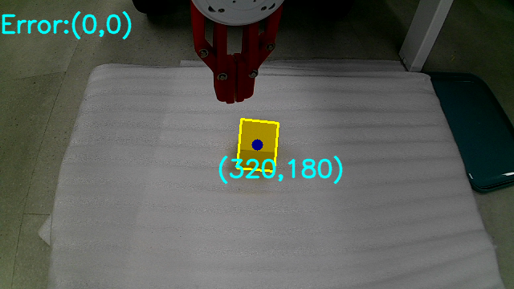

# 2. 实验2：使用OpenCV实现机械臂自动抓取和小车自动跟踪（线下实验）
## 2.1 传统视觉识别-OpenCV
## 2.2 实验2-1 机械臂自动抓取
### 2.2.1 环境配置

同实验1，检查完环境配置。

检查opencv是否正常安装，依次在终端中输入：

```bash
python
import cv2
print(cv2.__version__)
```

若正常安装，将显示opencv版本：

```
4.10.0  # 安装的版本可能不一
```

若未正常安装，在终端中输入：

```bash
pip install opencv-python
```

完成上述环境配置后，切换到本实验文件夹

```bash
cd Dora-Embodied-AI-Camp/lab2
```

### 2.2.2 修改yaml文件

在`Dora-Embodied-AI-Camp/lab2`文件夹中已写好一个`ctrl_opencv.yml`文件，内容如下：

```yaml
nodes:
  - id: opencv
    path: opencv.py
    inputs:
      key-interval: dora/timer/millis/10
      error-interval: dora/timer/millis/500
    outputs:
      - error
      - key

  - id: key-interpolation
    path: key_interpolation.py
    inputs:
      keyboard: opencv/key
    outputs:
      - text

  - id: trans-cmd
    path: trans_cmd.py
    inputs:
      text: key-interpolation/text
      error: opencv/error
    outputs:
      - movec
      - claw
      - save
      - clear
      - begin
      - stop
      - goto

  - id: arm
    path: gen72.py
    inputs:
      movec: trans-cmd/movec
      claw: trans-cmd/claw
      save: trans-cmd/save
      clear: trans-cmd/clear
      begin: trans-cmd/begin
      stop: trans-cmd/stop
      goto: trans-cmd/goto
    env:
      ROBOT_IP: 192.168.1.18  # gen72 机械臂默认IP

```
### 2.2.2 创建OpenCV图像识别节点同时实现按键检测

在`Dora-Embodied-AI-Camp/lab2`文件夹中已写好一个`opencv.py`文件，内容如下：

```python
import os
import numpy as np
import pyarrow as pa
import cv2
from dora import Node


os.environ['KMP_DUPLICATE_LIB_OK'] = 'True'


#定义一个形态学处理的函数
def good_thresh_img(img):
    gs_frame = cv2.GaussianBlur(img, (5, 5), 0)                     #高斯滤波
    hsv = cv2.cvtColor(gs_frame, cv2.COLOR_BGR2HSV)                 # 转化成HSV图像
    erode_hsv = cv2.erode(hsv, None, iterations=2)
    return erode_hsv

#定义一个识别目标颜色并处理的函数
def select_color_img(target_color,img):
        for i in target_color:
            mask=cv2.inRange(erode_hsv,color_dist[i]['Lower'],color_dist[i]['Upper'])
            if(i==target_color[0]):
                inRange_hsv=cv2.bitwise_and(erode_hsv,erode_hsv,mask = mask)
            else:
                inRange_hsv1=cv2.bitwise_and(erode_hsv,erode_hsv,mask = mask)
                inRange_hsv=cv2.add(inRange_hsv,inRange_hsv1)
        return  inRange_hsv

#定义一个提取轮廓的函数
def extract_contour(img):
    inRange_gray = cv2.cvtColor(final_inRange_hsv,cv2.COLOR_BGR2GRAY)
    contours,hierarchy = cv2.findContours(inRange_gray,cv2.RETR_TREE,cv2.CHAIN_APPROX_NONE)
    return contours
    
#定义一个寻找目标并绘制外接矩形的函数
def find_target(contours,draw_img):
    for c in contours:
        if cv2.contourArea(c) < 2000:             #过滤掉较面积小的物体
            continue
        else:
            target_list.append(c)               #将面积较大的物体视为目标并存入目标列表
    for i in target_list:                       #绘制目标外接矩形
        rect = cv2.minAreaRect(i)
        box = cv2.boxPoints(rect)
        cv2.drawContours(draw_img, [np.int0(box)], -1, (0, 255, 255), 2)
    return draw_img

#定义一个绘制中心点坐标的函数
def draw_center(target_list,draw_img):
    height, width, ch = draw_img.shape
    cv2.circle(draw_img, (width // 2, height // 2), 7, 128, -1)
    for c in target_list:
        M = cv2.moments(c)                   #计算中心点的x、y坐标
        center_x = int(M['m10']/M['m00'])
        center_y = int(M['m01']/M['m00'])
        print('center_x:',center_x)
        print('center_y:',center_y)
       
        cv2.circle(draw_img,(center_x,center_y),7,128,-1)#绘制中心点
        str1 = '(' + str(center_x)+ ',' +str(center_y) +')' #把坐标转化为字符串
        cv2.putText(draw_img,str1,(center_x-50,center_y+40),cv2.FONT_HERSHEY_SIMPLEX,1,(255,255,0),2,cv2.LINE_AA)#绘制坐标点位
    
    return draw_img

#计算误差
def get_error(target_list, draw_img):
    height, width, ch = draw_img.shape
    error_x, error_y = 0, 0
    for c in target_list:
        M = cv2.moments(c)
        center_x = int(M['m10']/M['m00'])
        center_y = int(M['m01']/M['m00'])

        error_x = width//2-center_x
        error_y = height//2-center_y
        str1 = "Error:"+'(' + str(error_x)+ ',' +str(error_y) +')' #把坐标转化为字符串
        cv2.putText(draw_img,str1,(0,40),cv2.FONT_HERSHEY_SIMPLEX,1,(255,255,0),2,cv2.LINE_AA)#绘制坐标点位
        break

    return error_x, error_y


###主函数部分
#创建颜色字典
color_dist = {'red': {'Lower': np.array([0, 60, 60]), 'Upper': np.array([6, 255, 255])},
              'yellow': {'Lower': np.array([15, 160, 50]), 'Upper': np.array([35, 255, 255])},
              'green': {'Lower': np.array([50, 50, 50]), 'Upper': np.array([130, 255, 255])},
              }

#目标颜色
target_color = ['yellow']

#创建摄像头
capture = cv2.VideoCapture(0)

#初始化保存图片的编号
count=0

node = Node()

for event in node:
    if event["type"] == "INPUT":
        #创建目标列表。注意一定要将其放入循环中，可以尝试一下将这一行注释掉，把目标列表建在外面，看看区别
        target_list=[]
        
        ret, img = capture.read()
        draw_img = img
        erode_hsv = good_thresh_img(img)
        final_inRange_hsv = select_color_img(target_color,erode_hsv)
        contours = extract_contour(final_inRange_hsv)
        draw_img = find_target(contours,draw_img)
        final_img = draw_center(target_list,draw_img)
        cv2.imshow('final_img', final_img)

        if event["id"] == "key-interval":
            key = cv2.waitKey(1)
            if key == 27:               #按Esc键退出
                break
            if key == -1 or key > 255:  #未按下则跳过
                continue
            elif key <= 255:
                node.send_output("key", pa.array([chr(key)]))

        if event["id"] == "error-interval":
            error_x, error_y = get_error(target_list,draw_img)
            node.send_output("error", pa.array([error_x, error_y]))

cv2.destroyAllWindows()      #关闭展示窗口
capture.release()            #释放摄像头，若不释放，程序结束后摄像头一直处于开启状态

```

### 2.2.3 修改命令识别节点

在`Dora-Embodied-AI-Camp/lab2`文件夹中已写好一个`trans_cmd.py`文件，内容如下：

```python
import pyarrow as pa
from enum import Enum
from dora import Node


PID_X = 0.0004
PID_Y = -0.0003

class Action(Enum):
    Xp      = ("arm Xp", "movec", [0.01, 0, 0, 0, 0, 0, 0.1])
    Xn      = ("arm Xn", "movec", [-0.01, 0, 0, 0, 0, 0, 0.1])
    Yp      = ("arm Yp", "movec", [0, 0.01, 0, 0, 0, 0, 0.1])
    Yn      = ("arm Yn", "movec", [0, -0.01, 0, 0, 0, 0, 0.1])
    Zp      = ("arm Zp", "movec", [0, 0, 0.01, 0, 0, 0, 0.1])
    Zn      = ("arm Zn", "movec", [0, 0, -0.01, 0, 0, 0, 0.1])
    take    = ("arm take", "claw", [0])
    put     = ("arm put", "claw", [100])

    save    = ("save", "save", [0])
    clear   = ("clear", "clear", [0])

    begin   = ("begin", "begin", [0])
    stop    = ("stop", "stop", [0])
    goto    = ("goto", "goto", [0])


node = Node()

for event in node:
    if event["type"] == "INPUT":
        if event["id"] == "text":
            text = event["value"][0].as_py()
            text = text.replace(".", "")
            text = text.replace(".", "")

            for action in Action:
                if action.value[0] in text:
                    node.send_output(action.value[1], pa.array(action.value[2]))
                    print(f"""recieved:{action.value[0]}""")

        if event["id"] == "error":
            [error_x, error_y] =  event["value"].tolist()
            move_error = [
                PID_Y*error_y,
                PID_X*error_x,
                0,
                0,
                0,
                0,
                0
            ]
            print(f"""move_error:{move_error}""")
            node.send_output("movec", pa.array(move_error))

```

### 2.2.4 启动并查看结果

同实验1，确认好机械臂正确连接。

然后确认摄像头正常连接，在终端输入：

```bash
ls /dev/video*
```

正常情况下，应该看到输出：
```
/dev/video0 /dev/video1 /dev/video2 /dev/video3
```

如若未正常显示，检查摄像头是否正确连接，并进入PCCAM状态

> 注意：使用OrangePi上面的USB Hub连接摄像头时，需要把Hub上的所有连接都拔下来，再从摄像头开始依次插入

确认上述正常后，启动dora的coordinator和daemon，在终端中输入：

```bash
dora up
```

成功启动后将看到输出：

```
started dora coordinator
started dora daemon
```

然后再在终端中输入：

```bash
dora start ctrl_opencv.yml
```

启动后可以看到图像界面，如下图：



随后，机械臂自动追踪黄色方块（根据opencv.py里写好的颜色），并停留在在其上。

## 2.3 四轮小车相关知识
## 2.4 实验2-2 小车自动跟踪
### 2.4.1 环境配置
### 2.4.2 创建小车底盘操作节点
### 2.4.3 启动并查看结果